```python
%pylab inline
```

    Populating the interactive namespace from numpy and matplotlib


```python
from sie import *
from sie.mcmc import *
```

## Fit a coin flip model


```python
h,N=data=17,25
```


```python
def P_data(data,theta):
    h,N=data
    distribution=Bernoulli(h,N)
    return distribution(theta)
```


```python
model=MCMCModel(data,P_data,
                theta=Uniform(0,1))
```


```python
model.run_mcmc(500)
model.plot_chains()
```

    Sampling Prior...
    Done.
    0.17 s
    Running MCMC...
    Done.
    0.83 s


    <matplotlib.figure.Figure at 0x10b6ab2d0>


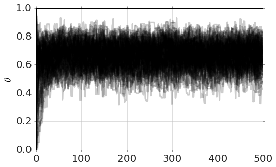


### run a bit longer...


```python
model.run_mcmc(500)
model.plot_chains()
```

    Running MCMC...
    Done.
    0.78 s


    <matplotlib.figure.Figure at 0x10e696e50>


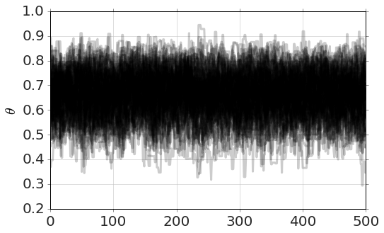


### Plot the MCMC distribution of $\theta$ and the Beta distribution solution

Hint: they should be the same


```python
model.plot_distributions()

dist=coinflip(h,N)
x=linspace(0,1.0,100)
px=dist.pdf(x)
plot(x,px,'r-')
```


    [<matplotlib.lines.Line2D at 0x10b78db90>]


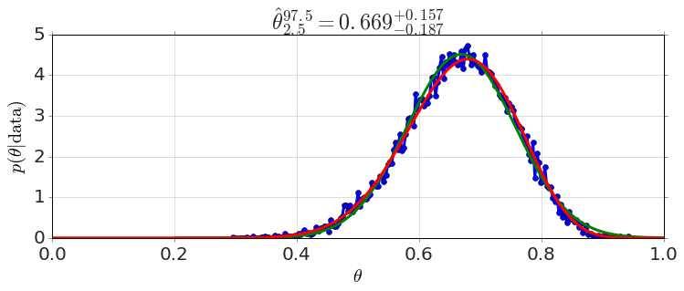


### Look at some probabilitiess


```python
model.P('theta>0.5')
```


    0.96173333333333333


```python
model.P('(0.2<theta) & (theta<.5)')
```


    0.038266666666666664


## Regression Example


```python
N=1000
x=arange(N)/1000.0
y=randn(N)+40+.25*x
plot(x,y,'o')
```


    [<matplotlib.lines.Line2D at 0x110f7b410>]


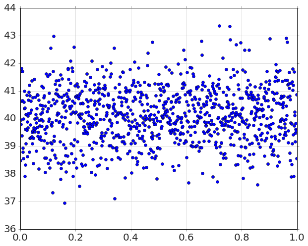


```python
def constant(x,a):
    return a

model=MCMCModel_Regression(x,y,constant,
            a=Uniform(0,100),
            )
model.run_mcmc(500)
model.plot_chains()
```

    Sampling Prior...
    Done.
    0.21 s
    Running MCMC...
    Done.
    1.39 s


    <matplotlib.figure.Figure at 0x10c028350>


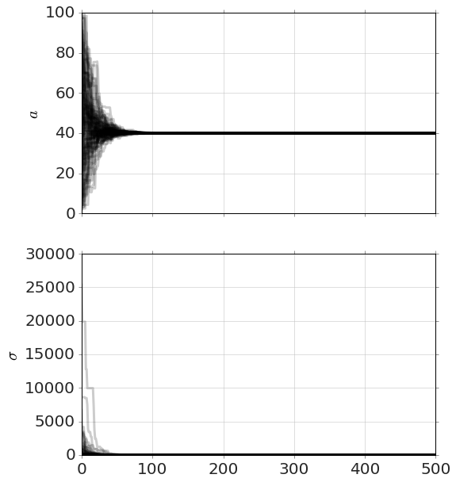


```python
model.plot_distributions()
```


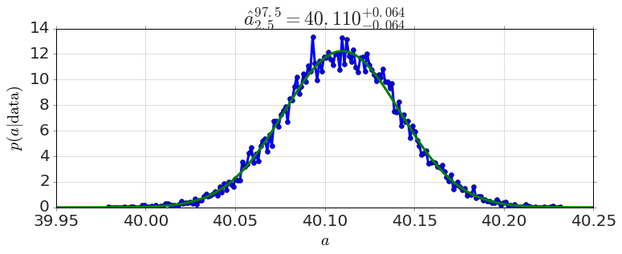


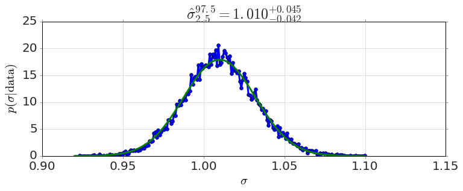


```python
plot(x,y,'o')

xfit=linspace(min(x),max(x),200)
yfit=model.predict(xfit)

plot(xfit,yfit,'-')
```


    [<matplotlib.lines.Line2D at 0x110f90c10>]


```python
plot(x,y,'o')
model.plot_predictions(xfit,color='g')
```


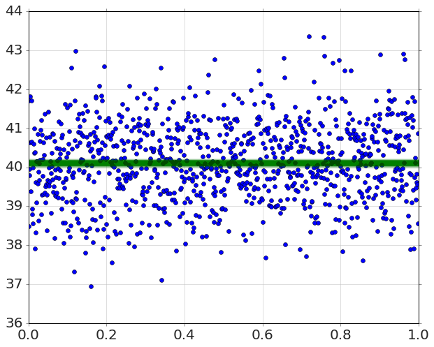


## Linear Model


```python
def linear(x,a,b):
    return a*x+b

model=MCMCModel_Regression(x,y,linear,
                a=Uniform(-10,10),
                b=Uniform(0,100),
                )

model.run_mcmc(500)
model.plot_chains()
```

    Sampling Prior...
    Done.
    0.26 s
    Running MCMC...
    Done.
    1.60 s


    <matplotlib.figure.Figure at 0x11120bcd0>


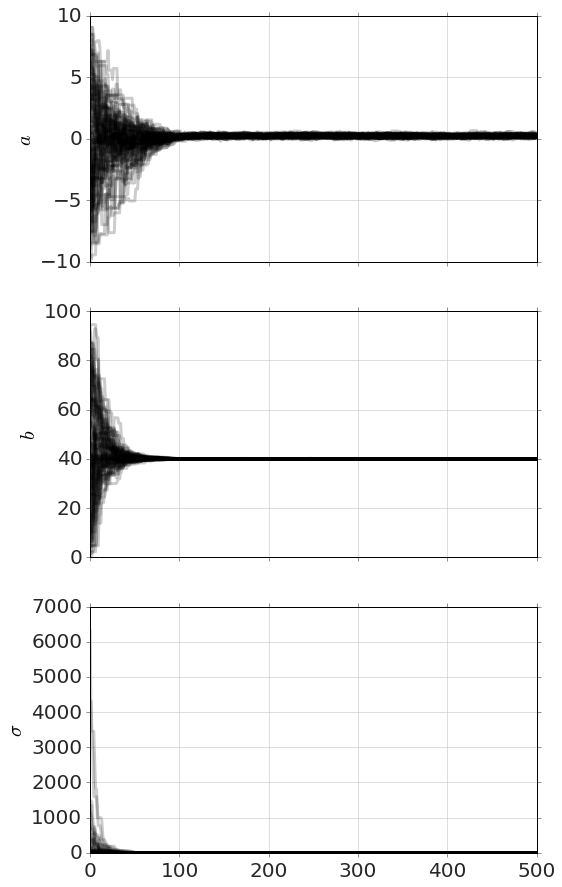


```python
plot(x,y,'o')
model.plot_predictions(xfit,color='g')
```


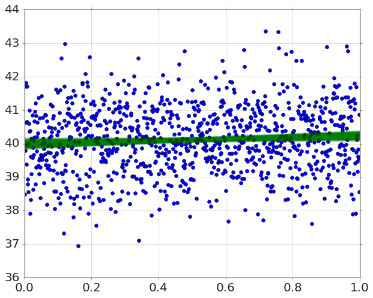


```python
model.plot_distributions()
```


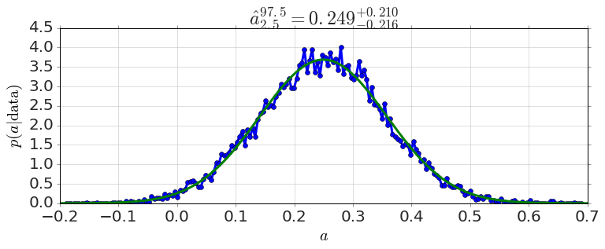


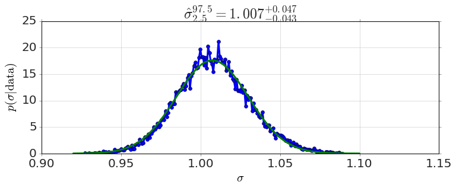


```python
model.triangle_plot()
```


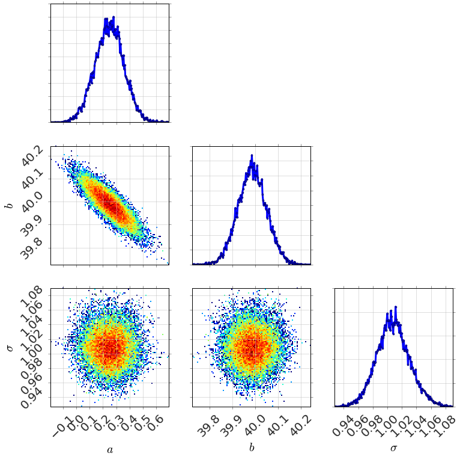


```python
model.percentiles([5,50,95])
```


    {'_sigma': array([ 0.97143798,  1.00744104,  1.0467333 ]),
     'a': array([ 0.07063144,  0.24939562,  0.42523751]),
     'b': array([ 39.88446461,  39.98633744,  40.09010139])}


```python
model.P('a>0')
```


    0.98936000000000002


```python

```
