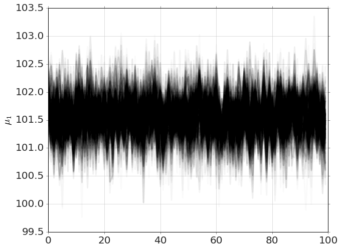
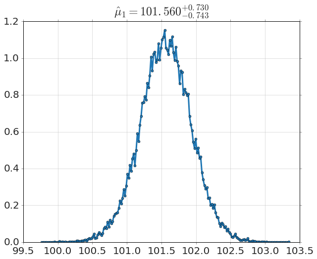
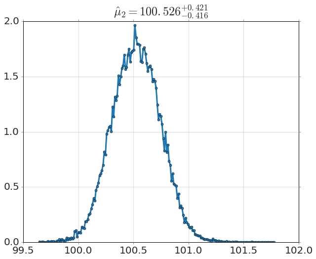
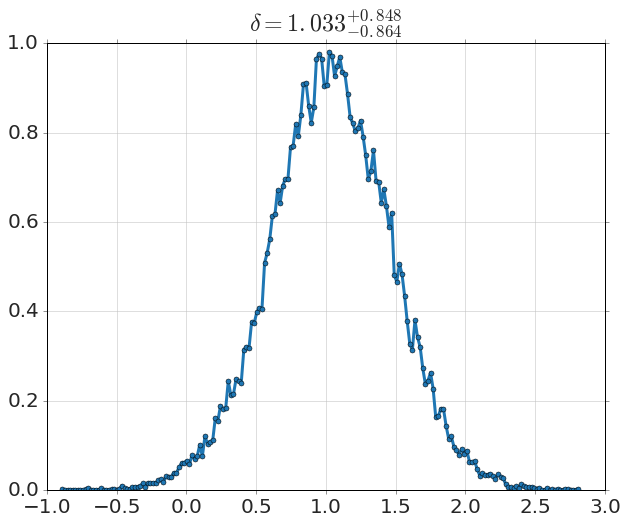

```python
from sie import *
```


```python
drug = (101,100,102,104,102,97,105,105,98,
        101,100,123,105,103,100,95,102,106,
        109,102,82,102,100,102,102,101,102,
        102,103,103,97,97,103,101,97,104,
        96,103,124,101,101,100,101,101,104,
        100,101)
placebo = (99,101,100,101,102,100,97,101,
           104,101,102,102,100,105,88,101,100,
           104,100,100,100,101,102,103,97,101,
           101,100,101,99,101,100,100,
           101,100,99,101,100,102,99,100,99)

model=mcmc.BESTModel(drug,placebo)
```


```python
model.run_mcmc()
```

    Running MCMC...
    Done.
    5.80 s


```python
model.names
```


    ['mu1', 'mu2', 'sigma1', 'sigma2', 'nu']


```python
model.plot_chains('mu1')
```





```python
model.plot_distribution('mu1')
```





```python
model.plot_distribution('mu2')
```





```python
model.plot_distribution(r'$\delta$=mu1-mu2')
```





```python

```
