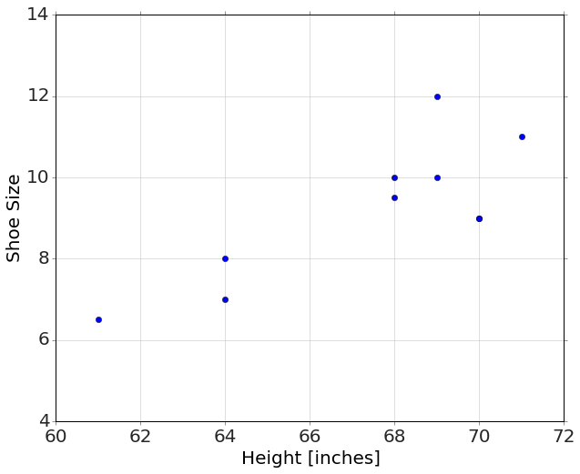
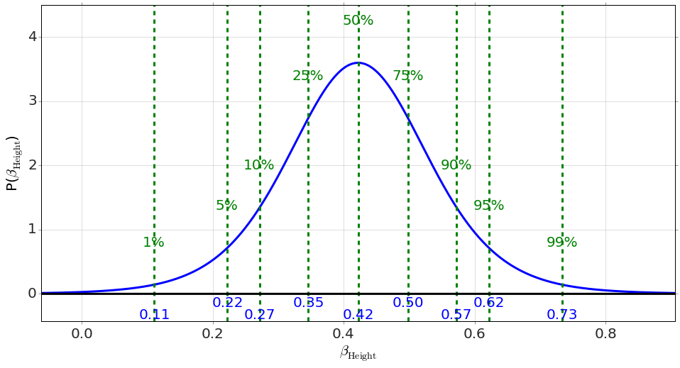
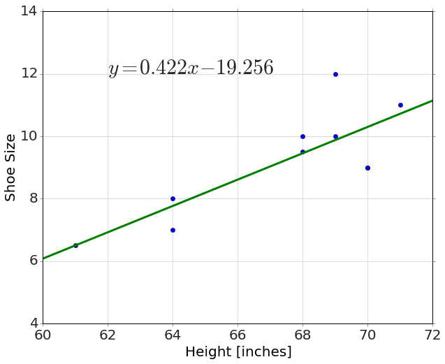
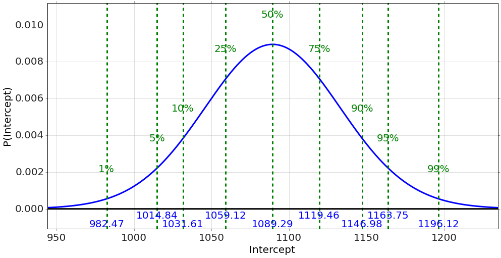

    from sie import *

##Shoe size data

    data=load_data('data/shoesize.xls')

    data.head()

<table border="1" class="dataframe">
  <thead>
    <tr style="text-align: right;">
      <th></th>
      <th>Index</th>
      <th>Gender</th>
      <th>Size</th>
      <th>Height</th>
    </tr>
  </thead>
  <tbody>
    <tr>
      <th>0</th>
      <td>1</td>
      <td>F</td>
      <td>5.5</td>
      <td>60</td>
    </tr>
    <tr>
      <th>1</th>
      <td>2</td>
      <td>F</td>
      <td>6.0</td>
      <td>60</td>
    </tr>
    <tr>
      <th>2</th>
      <td>3</td>
      <td>F</td>
      <td>7.0</td>
      <td>60</td>
    </tr>
    <tr>
      <th>3</th>
      <td>4</td>
      <td>F</td>
      <td>8.0</td>
      <td>60</td>
    </tr>
    <tr>
      <th>4</th>
      <td>5</td>
      <td>F</td>
      <td>8.0</td>
      <td>60</td>
    </tr>
  </tbody>
</table>

### Get a subset

    import random

    random.seed(102)
    rows = random.sample(data.index, 10)
    newdata=data.ix[rows]
    data=newdata
    data

<table border="1" class="dataframe">
  <thead>
    <tr style="text-align: right;">
      <th></th>
      <th>Index</th>
      <th>Gender</th>
      <th>Size</th>
      <th>Height</th>
    </tr>
  </thead>
  <tbody>
    <tr>
      <th>60</th>
      <td>61</td>
      <td>F</td>
      <td>7.0</td>
      <td>64</td>
    </tr>
    <tr>
      <th>251</th>
      <td>252</td>
      <td>M</td>
      <td>9.0</td>
      <td>70</td>
    </tr>
    <tr>
      <th>69</th>
      <td>70</td>
      <td>F</td>
      <td>8.0</td>
      <td>64</td>
    </tr>
    <tr>
      <th>290</th>
      <td>291</td>
      <td>M</td>
      <td>11.0</td>
      <td>71</td>
    </tr>
    <tr>
      <th>247</th>
      <td>248</td>
      <td>M</td>
      <td>12.0</td>
      <td>69</td>
    </tr>
    <tr>
      <th>156</th>
      <td>157</td>
      <td>F</td>
      <td>9.5</td>
      <td>68</td>
    </tr>
    <tr>
      <th>231</th>
      <td>232</td>
      <td>M</td>
      <td>10.0</td>
      <td>69</td>
    </tr>
    <tr>
      <th>17</th>
      <td>18</td>
      <td>F</td>
      <td>6.5</td>
      <td>61</td>
    </tr>
    <tr>
      <th>216</th>
      <td>217</td>
      <td>M</td>
      <td>10.0</td>
      <td>68</td>
    </tr>
    <tr>
      <th>252</th>
      <td>253</td>
      <td>M</td>
      <td>9.0</td>
      <td>70</td>
    </tr>
  </tbody>
</table>

    plot(data['Height'],data['Size'],'o')
    gca().set_xlim([60,72])
    gca().set_ylim([4,14])
    xlabel('Height [inches]')
    ylabel('Shoe Size')

    <matplotlib.text.Text at 0x10adae0d0>

### Do the regression

    result=regression('Size ~ Height',data)

    <matplotlib.figure.Figure at 0x10d200710>

    <matplotlib.figure.Figure at 0x10d702610>

    plot(data['Height'],data['Size'],'o')
    
    h=linspace(60,72,10)
    plot(h,result['_Predict'](Height=h),'-')
    
    gca().set_xlim([60,72])
    gca().set_ylim([4,14])
    xlabel('Height [inches]')
    ylabel('Shoe Size')
    
    b=result.Intercept.mean()
    m=result.Height.mean()
    
    if b>0:
        text(62,12,'$y=%.3f x + %.3f$' % (m,b),fontsize=30)
    else:
        text(62,12,'$y=%.3f x %.3f$' % (m,b),fontsize=30)

## SAT Data

    data=load_data('data/sat.csv')

### Simple Linear Regression

    result=regression('total ~ expenditure',data)

    <matplotlib.figure.Figure at 0x1109156d0>

    <matplotlib.figure.Figure at 0x110953110>

    plot(data['expenditure'],data['total'],'o')
    xlabel('Expenditure [per pupil, thousands]')
    ylabel('SAT Total')
    h=linspace(3,10,10)
    plot(h,result['_Predict'](expenditure=h),'-')
    
    b=result.Intercept.mean()
    m=result.expenditure.mean()
    
    if b>0:
        text(4.5,1125,'$y=%.3f x + %.3f$' % (m,b),fontsize=30)
    else:
        text(4.5,1125,'$y=%.3f x %.3f$' % (m,b),fontsize=30)

    result=regression('percent_taking ~ expenditure',data)

    <matplotlib.figure.Figure at 0x111cfff10>

    <matplotlib.figure.Figure at 0x111867750>

    plot(data['expenditure'],data['percent_taking'],'o')
    xlabel('Expenditure [per pupil, thousands]')
    ylabel('SAT Total')
    h=linspace(3,10,10)
    plot(h,result['_Predict'](expenditure=h),'-')
    
    b=result.Intercept.mean()
    m=result.expenditure.mean()
    
    if b>0:
        text(4.5,85,'$y=%.3f x + %.3f$' % (m,b),fontsize=30)
    else:
        text(4.5,85,'$y=%.3f x %.3f$' % (m,b),fontsize=30)

### Multiple Regression

    result=regression('total ~ expenditure + percent_taking',data)

    <matplotlib.figure.Figure at 0x1107f5fd0>

    <matplotlib.figure.Figure at 0x10d70a690>

    <matplotlib.figure.Figure at 0x110fbcf90>

    
